# 前端调试通关秘籍

[掘金小册](https://juejin.cn/book/7070324244772716556)

## 什么是调试

代码在某个平台运行，把运行时的状态通过某种方式暴漏出来，传递给开发工具做 UI 的展示和交互，辅助开发者排查问题、梳理流程、了解代码运行状态等，这个就是调试

## Chrome DevTools 原理

调试工具的四要素：frontend、background、调试协议、信道

## VSCode debugger 配置

| 属性                   | 说明                               |
| ---------------------- | ---------------------------------- |
| type                   | 调试类型，一般为 node              |
| name                   | 调试配置名称                       |
| port                   | 调试端口                           |
| request                | 请求类型，launch/attach            |
| userDataDir            | 调试程序的用户数据目录             |
| runtimeExecutable      | 调试程序的可执行文件               |
| runtimeArgs            | 调试程序的可执行文件的参数         |
| sourceMaps             | 是否启用 sourceMaps                |
| file                   | 调试的文件                         |
| program                | 调试的程序入口                     |
| args                   | 调试程序的参数                     |
| cwd                    | 调试程序的工作目录                 |
| env                    | 调试程序的环境变量                 |
| protocol               | 调试协议，一般为 inspector         |
| console                | 调试控制台，一般为 internalConsole |
| internalConsoleOptions | 调试控制台的配置                   |
| stopOnEntry            | 是否在入口处停止                   |
| trace                  | 是否启用 trace                     |
| traceResponse          | 是否启用 traceResponse             |
| timeout                | 调试超时时间                       |
| preLaunchTask          | 调试前执行的任务                   |
| postDebugTask          | 调试后执行的任务                   |

## sourcemap

| 属性           | 说明                       |
| -------------- | -------------------------- |
| version        | sourcemap 版本号，目前为 3 |
| file           | 编译后的文件名             |
| sourceRoot     | 源码根目录                 |
| names          | 转换前的变量名             |
| sources        | 转换前的文件名             |
| sourcesContent | 转换前的文件内容           |
| mappings       | 转换前的位置               |

## 作用域

| 属性    | 说明                               |
| ------- | ---------------------------------- |
| Global  | 全局作用域                         |
| Local   | 局部作用域,或者函数作用域          |
| Block   | 块级作用域                         |
| Script  |                                    |
| Module  | 模块作用域                         |
| Catch   | Catch 语句的作用域可以方位错误对象 |
| With    | with 语句的作用域                  |
| Closure | 闭包作用域                         |
| Eval    | eval 语句的作用域                  |

## 打断点的方式

| 方式                | 说明                                                             |
| ------------------- | ---------------------------------------------------------------- |
| 断点                | 通过代码中的断点来打断                                           |
| 条件断点            | 通过代码中的断点来打断，但是需要满足一定的条件                   |
| 监视表达式          | 通过监视表达式来打断                                             |
| 异常断点            | 通过异常断点来打断                                               |
| 日志断点            | 通过日志断点来打断                                               |
| DOM 断点            | 通过 DOM 断点来打断，当 DOM 节点发生变化时，会触发断点           |
| XHR 断点            | 通过 XHR 断点来打断，当 XHR 请求发生时，会触发断点               |
| Fetch 断点          | 通过 Fetch 断点来打断，当 Fetch 请求发生时，会触发断点           |
| Event Listener 断点 | 通过 Event Listener 断点来打断，当事件监听器被触发时，会触发断点 |

## Performance

灰色的是浏览器的渲染线程，蓝色的是浏览器的 JS 引擎线程，黄色的是浏览器的网络线程，绿色的是浏览器的事件线程

## 微任务和宏任务

微任务

1. Promise
2. MutationObserver
3. process.nextTick
4. Object.observe
5. queueMicrotask

宏任务

1. setTimeout
2. setInterval
3. setImmediate
4. requestAnimationFrame
5. I/O
6. UI rendering

## Web vitals 网页性能指标

| 指标    | 全拼                     | 说明                                                                   |
| ------- | ------------------------ | ---------------------------------------------------------------------- |
| TTFB    | Time To First Byte       | 首字节时间，即浏览器发起请求到浏览器收到响应的第一个字节的时间         |
| FP      | First Paint              | 首次绘制时间，即页面首次绘制的时间                                     |
| FCP     | First Contentful Paint   | 首次内容绘制时间，即首次绘制的内容，如图片、文字等，不包括背景色       |
| **LCP** | Largest Contentful Paint | 最大内容绘制时间，即页面中最大的绘制内容，如图片、文字等，不包括背景色 |
| FMP     | First Meaningful Paint   | 首次有意义绘制时间，即页面首次绘制的内容，如图片、文字等，不包括背景色 |
| DCL     | DOM Content Loaded       | DOM 加载完成的时间，即 DOM 结构加载完成的时间                          |
| TTI     | Time To Interactive      | 首次可交互时间，即页面首次可交互的时间                                 |
| **FID** | First Input Delay        | 首次输入延迟时间，即用户第一次交互到浏览器响应的时间                   |
| TBT     | Total Blocking Time      | 阻塞总时长                                                             |
| **CLS** | Cumulative Layout Shift  | 布局稳定性，即页面布局是否稳定                                         |
| SI      | Speed Index              | 加载速度指数，即页面加载的速度                                         |

> LCP、FID、CLS 是核心指标
